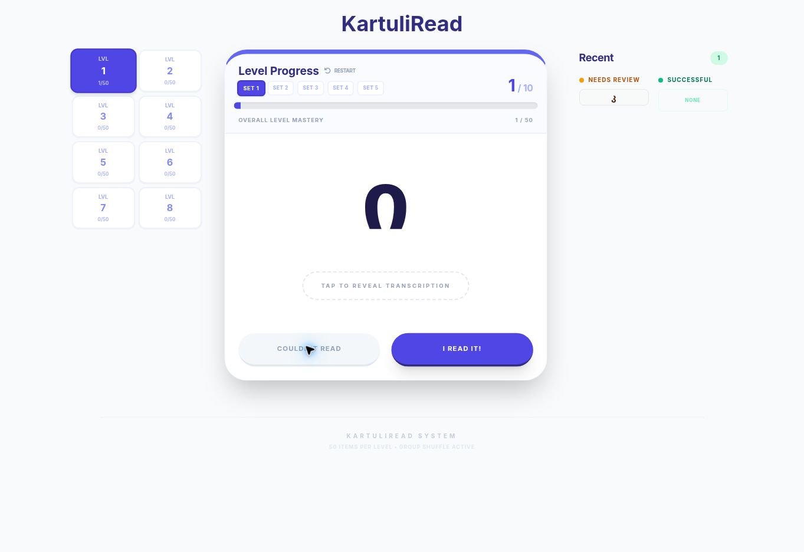
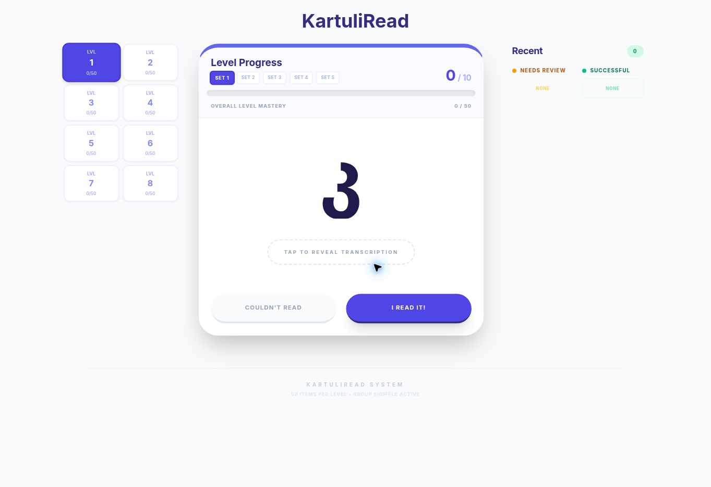
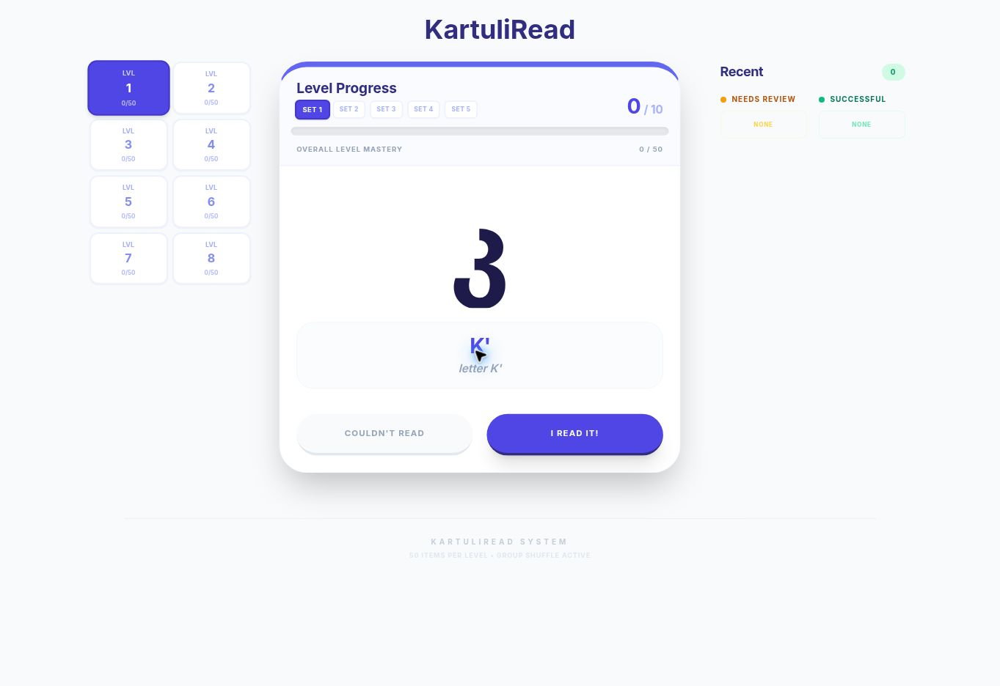
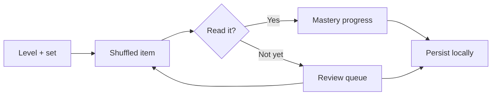

# KartuliRead

**Adaptive Georgian reading practice with progressive levels and repetition of missed items.**

KartuliRead teaches recognition before translation: the learner reads Georgian script, reveals the transcription when needed, and records whether the item was read successfully. Missed items return for another attempt.



[Open the deployed app](https://kartuliread.vercel.app)

## Why it exists

Beginning Georgian learners can memorize vocabulary while still decoding the alphabet too slowly to read. KartuliRead isolates that bottleneck and gives the learner a short, repeatable recognition loop.

The app avoids a generic flash-card sequence. Content is arranged into eight levels and five sets per level, progress is explicit, and missed items feed a repetition queue until they can be read.

## What it does

- organizes Georgian reading material into eight progressive levels;
- presents one Georgian item at a time without exposing the answer;
- reveals transcription and meaning on demand;
- records successful and missed items separately;
- repeats missed items in a dedicated review mode;
- tracks set and level mastery;
- persists progress and mastery state in the browser;
- adapts typography and layout across phone and desktop screens.

| Read first | Reveal when needed | See what needs review |
| --- | --- | --- |
|  |  |  |

## How it works



The React client loads a static, pre-generated exercise library. A level contains five sets of ten items. Session state tracks the current group, successful history, failed queue, and repetition index; persisted state restores per-level progress and completed sets.

No model API is called at runtime. Static content keeps the learning loop fast, deterministic, and usable without an account.

## A few implementation notes

- **Error-driven repetition:** missed items become the next review set rather than disappearing into a score.
- **Mastery hierarchy:** progress is modeled at item, set, and level granularity.
- **Deterministic runtime content:** exercises are validated and built ahead of time.
- **Persistence:** progress, completed sets, and learning state survive reloads.
- **Responsive reading UI:** Georgian and transcription font sizes are fitted independently to the available space.
- **Data validation tooling:** repository scripts check exercise integrity and regenerate letter-count references.

## Tech stack

React 19, TypeScript, Vite, CSS, browser local storage, static exercise data.

## Running locally

```bash
npm ci
npm run check:data
npm run dev
```

## Checks

```bash
npm run check:data
npm run typecheck
npm run build
```

## Current state

**Working web application with a deployed version.** All eight levels, progress tracking, mastery state, missed-item repetition, responsive layout, and local persistence are implemented.

## License

No open-source license has been declared.
